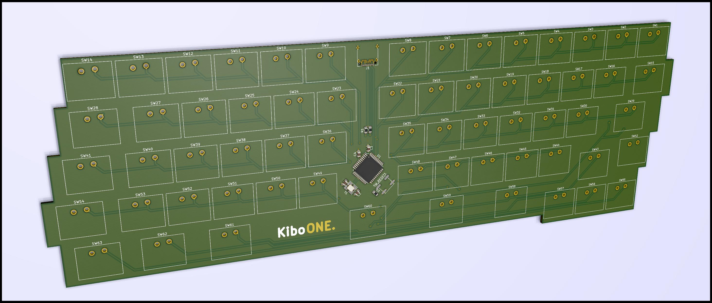

# Kibo One

A keyboard built from the ground up to my personal preferences, using switches and keycaps from 1980s Apple keyboards. Very much a work in progress.

Some design guidelines:

* Must be fun to make
* Alps switches are nice
* AEK-era Apple keycaps are nice
* Stabilizers are the devil
* The width of standard ANSI shift keys is ridicilous
* The width of a standard spacebar is ridiculous
* Actually, no key _really_ deserves to be wider than 2u
* The thumb is underused for modifier keys
* The left-leaning stagger for the left hand on standard keyboards seems a bit silly

More to come.
